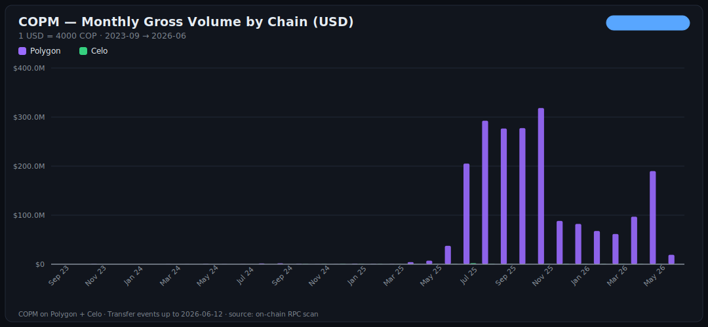
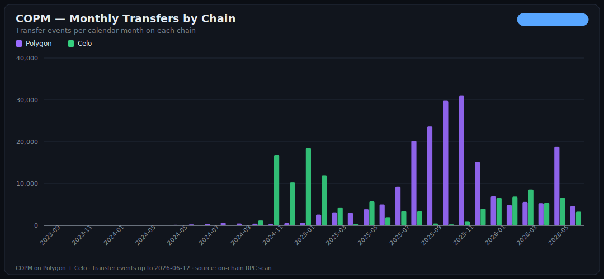
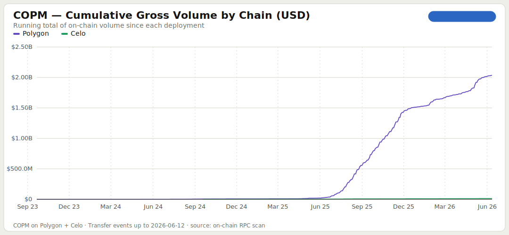
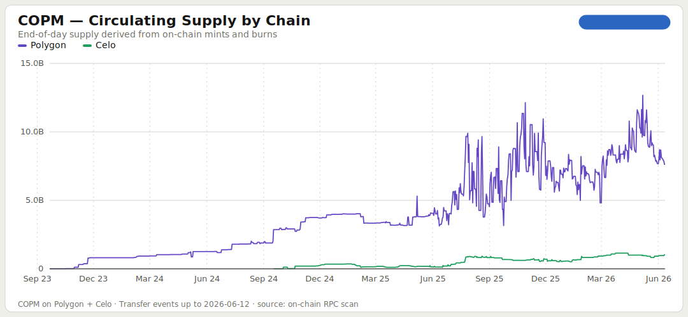

# COPM — Auditoría y análisis on-chain unificado (Polygon + Celo)

> La vista consolidada de COPM, la stablecoin de peso colombiano de [Minteo](https://minteo.com/), a través de sus dos deployments EVM: **Polygon** y **Celo**. Cada número sale de eventos `Transfer` leídos directamente de cada chain y validados contra el estado on-chain en vivo.
>
> 🇬🇧 [English version](./AUDIT.md) · 📖 [Glosario](./GLOSSARY.es.md)
>
> ¿Quieres el detalle de una sola chain? Cada una tiene su auditoría independiente: **[Polygon](./audit/polygon.es.md)** · **[Celo](./audit/celo.es.md)**

## Los números, lado a lado

| Métrica | Polygon | Celo | **Total** |
| :--- | ---: | ---: | ---: |
| Deploy del contrato | 2023-09-19 | 2024-09-11 | — |
| Días auditados | 996 | 634 | — |
| Eventos `Transfer` | 196,796 | 120,900 | **317,696** |
| Volumen bruto (USD) | $2,034M | $11.7M | **~$2,046M (~$2.05B)** |
| Volumen neto (USD) | $1,447M | $9.3M | **$1,456M** |
| Ticket promedio | ~$10,300 | ~$96 | — |
| Pico de transacciones/día | 2,597 (2025-11-24) | 1,919 (2025-01-19) | — |
| Pico de volumen/día | $38.6M (2025-11-24) | $737K (2025-07-23) | — |
| Mes pico (volumen) | $318.4M (nov 2025) | $2.15M (jul 2025) | — |
| Supply on-chain actual | 6.32B COPM | 1.03B COPM | **7.35B COPM ≈ $1.84M** |
| Checks de validación | 12/12 ✅ | 12/12 ✅ | **24/24 ✅** |

> Tasa de cambio: 1 USD = 4,000 COP, constante (±5% de margen). Misma metodología, mismos scripts, [mismas validaciones](#validación) en ambas chains.

---

## Una stablecoin, dos roles

Mira el ticket promedio: **$10,300 en Polygon, $96 en Celo**. Esa diferencia de dos órdenes de magnitud no es ruido — es arquitectura.

Polygon es el rail institucional: settlement B2B, montos grandes, los $2B de volumen histórico. Celo es la red de pagos pequeños: remesas, micropagos, billeteras de usuario final — con un conteo de transacciones diarias casi idéntico al de Polygon (~191 vs ~198), pero moviendo la milésima parte del valor.



## El relevo entre chains se ve a simple vista

El gráfico de transacciones mensuales cuenta una historia que ningún dashboard interno podría contar mejor: **Celo despegó primero en actividad** (su pico de 18,491 transacciones fue en enero 2025, apenas 4 meses después del deploy), y **Polygon tomó el relevo** con la ola institucional de mediados-finales de 2025 que culminó en el récord de noviembre.



También explica por qué la segunda chain despega más rápido: COPM tardó **17 meses** en superar las 100 transacciones diarias en Polygon, y **6 semanas** en lograrlo en Celo. La segunda chain no empieza de cero — hereda partners, operación y casos de uso ya probados.

## El acumulado: ~$2.05B y subiendo



## El supply de cada chain, derivado evento por evento



En Celo, el supply derivado de reproducir los 120,900 eventos cuadra **exacto** (0.0% de desviación) contra el `totalSupply()` del contrato en vivo. En Polygon hay una diferencia conocida de ~1.3B COPM atribuible a operaciones del proxy (documentada en [su auditoría](./audit/polygon.es.md#limitaciones)); no afecta volúmenes ni picos.

---

## Validación

Las dos auditorías corren la misma batería de 12 checks — integridad del dataset, continuidad de la serie, invariantes contables (mints − burns = supply) y **spot checks contra la chain en vivo** (transfers aleatorios re-verificados contra sus receipts o contra una consulta fresca de logs). Resultado: **24/24 en verde**.

| Chain | Checks | Detalle |
| :--- | :--- | :--- |
| Polygon | 12/12 ✅ | [`data/polygon/validation.json`](./data/polygon/validation.json) |
| Celo | 12/12 ✅ | [`data/celo/validation.json`](./data/celo/validation.json) |

## Por qué puedes confiar en estos números

1. **Fuente primaria.** Nada viene de dashboards, indexers ni APIs de terceros: solo llamadas RPC estándar contra cada chain. Sirve un RPC de pago o uno público.
2. **Reproducible.** Todo el pipeline está en este repositorio. `npm run audit:all` y obtienes los mismos números (más los eventos nuevos desde esta corrida).
3. **Validado.** Cada artefacto del pipeline pasa checks de consistencia interna y contra el estado vivo de la chain antes de reportarse.
4. **Público por definición.** La blockchain es un registro público: esta auditoría no usa — ni necesita — información interna de ninguna empresa.

## Reproduce todo

```bash
cp .env.example .env   # configura tus RPCs
npm install
npm run audit:all      # ambas chains + charts combinados
```

Los detalles de metodología y limitaciones viven en cada auditoría individual: [Polygon](./audit/polygon.es.md) · [Celo](./audit/celo.es.md).
