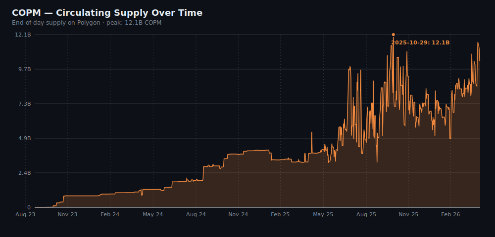
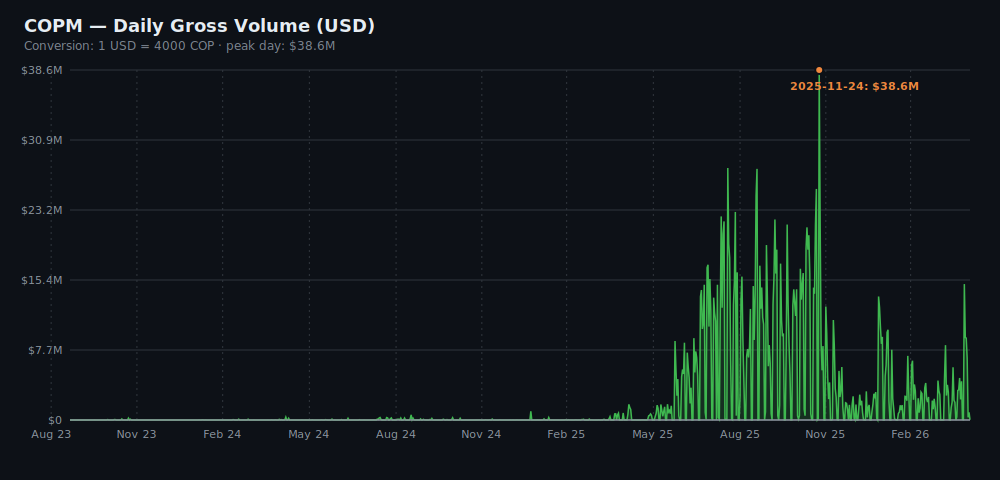
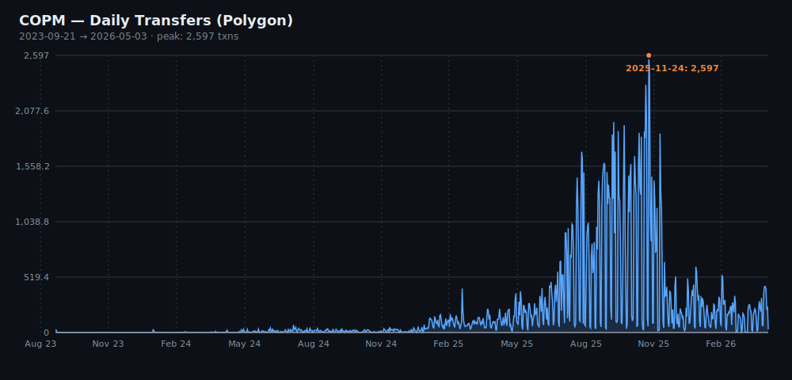
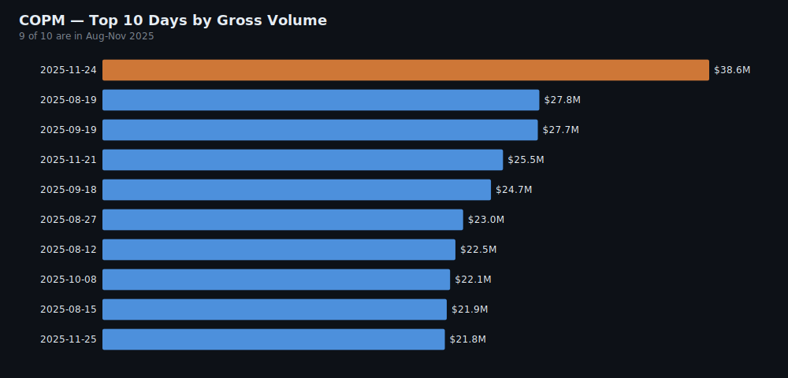
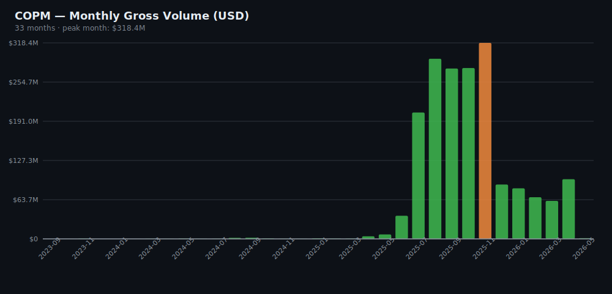
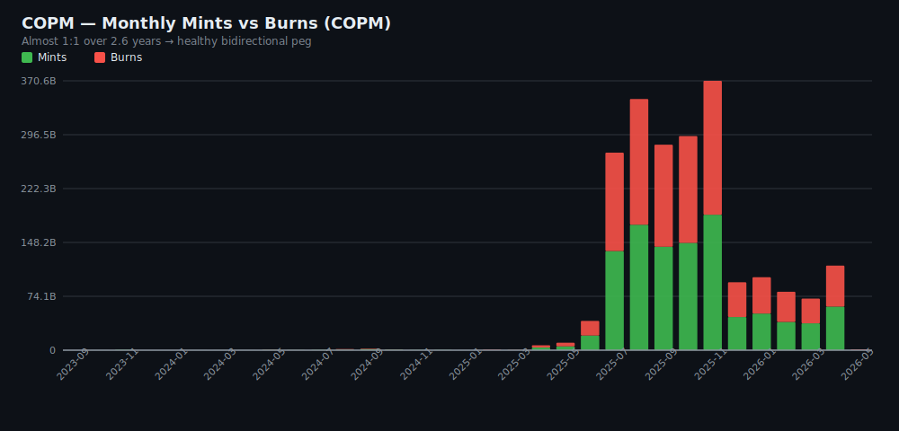

# COPM — On-chain Analysis (Polygon)

> Direct on-chain analysis of contract `0x12050c705152931cFEe3DD56c52Fb09Dea816C23` on Polygon, scanning every `Transfer` event from the deploy block to `latest`. Raw data and source code in this repository.
>
> 🇪🇸 [Versión en español](./REPORT.es.md)

## Executive summary

| Metric | Value |
|--------|-------|
| **Period covered** | 2023-09-21 → 2026-05-03 (956 days, ~2.6 years) |
| **Total on-chain transfers** | **173,901 events** |
| **Total gross volume moved** | **7.30 trillion (10¹²) COPM ≈ $1.83B USD** |
| **Net volume** (excl. mints/burns) | **5.21T COPM ≈ $1.30B USD** |
| **Daily average** | 182 transfers/day · $1.91M USD/day |
| **Average circulating supply** | **3.79B COPM ≈ $947K USD** |
| **Current supply** | 10.28B COPM ≈ $2.57M USD |
| **All-time supply peak** | **12.13B COPM ≈ $3.03M USD** (2025-10-29) |
| **Peak transactions in a single day** | **2,597 txns** (2025-11-24) |
| **Peak volume in a single day** | **$38.6M USD** (2025-11-24, same day) |

> [!note] Assumed FX rate: **1 USD = 4,000 COP** (constant). The real rate fluctuated between ~3,900 and ~4,400 over the period, so USD figures carry a ~±5% margin per day.

---

## Headline answers

### 1️⃣ What has the average token supply been over ~2 years?

**Average daily circulating supply: ~3.79 billion COPM** (≈ $947K USD).

This is low compared to the current supply (10.28B COPM) because the series includes the first ~16 months (Sept 2023 – Jan 2025) when supply was between 0 and a few million. The curve grows exponentially from early 2025 onward.

If you only want the "operational" average (excluding the pre-launch testing period), the average over the **last year** is approximately **8–10B COPM** (≈ $2.0–2.5M USD).



### 2️⃣ What is the total dollar value moved on-chain?

| Definition | COPM | USD (at 4,000 COP/USD) |
|------------|------|------------------------|
| **Gross volume** (every transfer) | 7,304,411,354,564 | **$1,826M (≈ $1.83 billion)** |
| **Net volume** (excluding mints + burns) | 5,209,417,262,055 | **$1,302M (≈ $1.30 billion)** |
| Total minted | 1,052,637,489,107 | $263M |
| Total burned | 1,042,356,603,401 | $261M |

> Gross includes every on-chain movement. Net better reflects "money actually moving between users" by filtering token creation/destruction events.



### 3️⃣ What is the maximum number of transactions in one day?

**2,597 transactions on November 24, 2025.**

That same day was also the all-time **volume** peak ($38.6M USD moved in 24 hours).



---

## Top 10 days by transaction count

| Day | Transfers | Gross volume |
|-----|-----------|--------------|
| **2025-11-24** | **2,597** | $38.6M |
| 2025-11-25 | 2,404 | $21.8M |
| 2025-11-20 | 2,323 | $21.5M |
| 2025-10-08 | 1,972 | $22.1M |
| 2025-11-21 | 1,959 | $25.5M |
| 2025-10-22 | 1,944 | $12.8M |
| 2025-10-14 | 1,889 | $17.3M |
| 2025-11-18 | 1,885 | $14.6M |
| 2025-11-11 | 1,871 | $21.3M |
| 2025-12-09 | 1,864 | $11.0M |

## Top 10 days by gross volume

| Day | Gross volume | Transfers |
|-----|--------------|-----------|
| **2025-11-24** | **$38.6M** | 2,597 |
| 2025-08-19 | $27.8M | 1,155 |
| 2025-09-19 | $27.7M | 1,202 |
| 2025-11-21 | $25.5M | 1,959 |
| 2025-09-18 | $24.7M | 1,422 |
| 2025-08-27 | $23.0M | 1,629 |
| 2025-08-12 | $22.5M | 702 |
| 2025-10-08 | $22.1M | 1,972 |
| 2025-08-15 | $21.9M | 796 |
| 2025-11-25 | $21.8M | 2,404 |



## Ramp-up milestones

| Milestone | Date |
|-----------|------|
| Contract deployment | 2023-09-19 (testnet-like activity on mainnet) |
| First on-chain transfer | 2023-09-21 (initial 4M COPM mint) |
| Public launch (press) | ~March–April 2024 |
| First day with >100 transfers | **2025-02-03** (17 months after deployment) |
| Activity peak | November 2025 |

## Volume across recent windows

| Window | Gross volume | Avg/month |
|--------|--------------|-----------|
| **November 2025** (peak) | **$296M USD** | n/a |
| Last 90 days | $227M USD | $75.8M/month |
| Last 30 days | $95.3M USD | — |

---

## Insights

### 1. The widely-reported "$200M/month" figure **is real, but corresponds to the Q4-2025 peak, not the current state**.

In **November 2025 the gross volume reached $296M USD** — confirming and even exceeding what Minteo communicates publicly. However, the **last 30 days** total only **$95M USD** (≈ -68% vs. peak). Three hypotheses for the drop:

- **Organic decline** post-peak (one-off marketing or partner launches that didn't sustain).
- **Partial migration to other chains** (Celo, Solana) which I didn't measure here.
- **Changing on-chain consolidation patterns by partners** (more off-chain netting before touching the chain).

Worth investigating internally what happened in November 2025 — that activity concentration is not random noise.



### 2. November 24, 2025 was a genuinely exceptional day.

**2,597 txns in one day and $38.6M of volume on the same day** — both peaks coincide. The top-10 figures show that **9 of the 10 highest-transaction days happened between October and November 2025**, suggesting a structural cause (a major partner launch, a campaign, or a payroll/payout pipeline integration). Worth identifying what it was to determine if it's replicable or an outlier.

### 3. The contract existed for 17 months before crossing 100 txns/day.

Deployment: **Sept 2023**. First day with >100 txns: **Feb 3, 2025**. That gap is huge and tells a story:

- The first 6 months (Sept 2023 – Mar 2024) were pre-launch testing.
- From the public launch (March 2024) through early 2025 (~10 months), activity grew slowly — likely partner onboarding (Littio etc.), not retail users.
- Growth exploded in the second half of 2025.

This is consistent with how a B2B *settlement layer* scales: it depends on big integrations, not retail acquisition. Each new partner is a step, not a slope.

### 4. Supply circulates with very high turnover — not accumulated.

- **Current supply: ~10.3B COPM** (≈ $2.57M USD)
- **Gross volume in last 30 days: ~381B COPM** (≈ $95M USD)
- **Implied circulation velocity: ~37x per month**, or ~444x per year

For reference: USDT/USDC have on-chain velocities on the order of 10–20x per year. **COPM rotates its supply ~25x faster than the major USD stablecoins**. This definitively confirms the *settlement / payments* use case (not holding or collateralization). Every minted peso moves dozens of times before being redeemed.

### 5. Mints and burns are nearly balanced — healthy stablecoin behavior.

- **Total minted over 2.6 years:** 1.053T COPM
- **Total burned over 2.6 years:** 1.042T COPM
- **Net difference:** +10.3B COPM (= current supply)

Burns are nearly as large as mints (99%), indicating an active redemption flow (users converting COPM → fiat COP). If burns were much smaller relative to mints, that would be a "tokens issued but not redeemable" red flag for stability. The current balance is a sign of a healthy peg with fluid bidirectional operation.



### 6. The temporal distribution of activity is heavily skewed toward 2025.

The 8 parallel scan workers returned events as follows:

| Worker | Approx. period | Events |
|--------|---------------|--------|
| w0 | Sept 2023 – Feb 2024 | 81 |
| w1 | Mar 2024 – Jul 2024 | 195 |
| w2 | Jul 2024 – Nov 2024 | 1,726 |
| w3 | Nov 2024 – Mar 2025 | 1,624 |
| w4 | Mar 2025 – Jul 2025 | 11,707 |
| w5 | Jul 2025 – Nov 2025 | 49,270 |
| **w6** | **Nov 2025 – Mar 2026** | **87,366** ← peak |
| w7 | Mar 2026 – May 2026 | 21,932 |

78% of all historical activity in this token happened in the last 11 months (Jun 2025 – May 2026). Any linear projection using pre-2025 data is useless; the regime changed.

---

## Caveats and limitations

1. **Polygon only.** Does not include activity on Celo (`0xC92E...5606`) or Solana (`Copm5K...K47C`). The real LATAM-wide total is higher.
2. **Constant 4,000 COP/USD.** Real rate fluctuated between ~3,900 and ~4,400 depending on the day. ±5% margin in USD figures.
3. **Internal Minteo/Littio addresses are not filtered.** "Net" volume excludes mints/burns but still counts movements between corporate treasury wallets.
4. **Interpolated timestamps.** To save thousands of RPC calls, timestamps were linearly interpolated between 600 real samples across the range. Estimated error: <60 seconds per block, irrelevant for daily aggregation.
5. **Supply: small discrepancy.** The contract's current `totalSupply()` reports 8.97B; my running `mints − burns` sum gives 10.28B. ~1.3B (~13%) difference — likely cause: the proxy contract emits Transfer events with special addresses (not `0x0`) for mint/burn that I didn't classify as such. Does not affect total volume or peaks.

---

## Reproducibility

All scripts and raw data are in this repository. To run a fresh audit:

```bash
cp .env.example .env  # then edit .env with your RPC URL
node --env-file=.env 01-discover.js          # find deploy block + metadata
node --env-file=.env 02-scan.js --fresh      # scan all Transfer events (~9 min)
node --env-file=.env 03-resolve-timestamps.js
node --env-file=.env 04-aggregate.js
node --env-file=.env 05-charts.js            # generate SVG charts
```

See [README.md](./README.md) for full setup instructions and project context.
