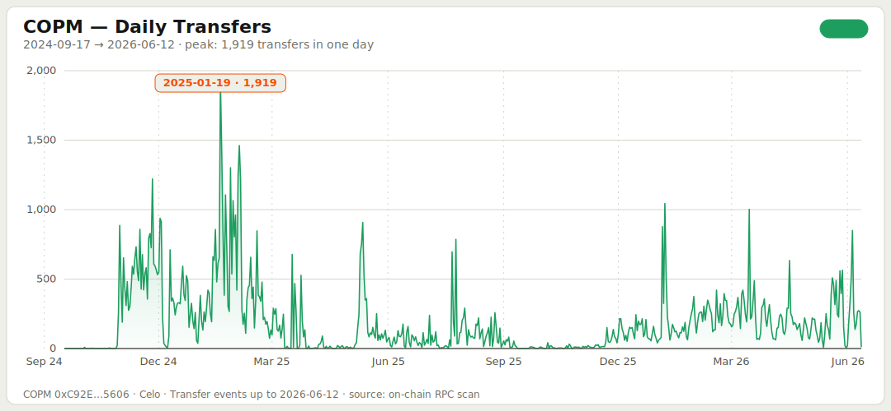
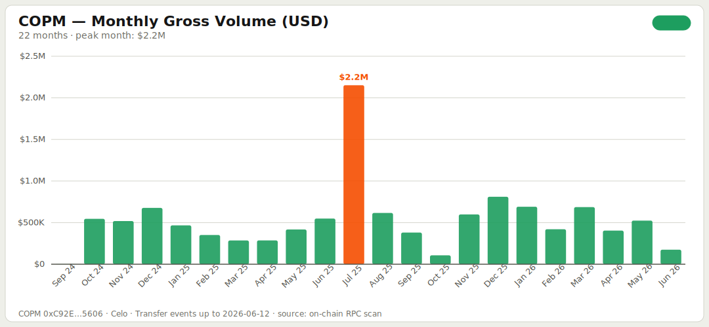
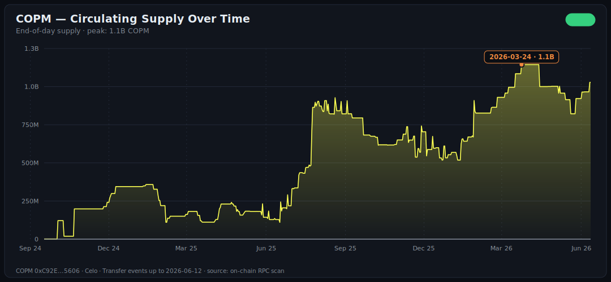
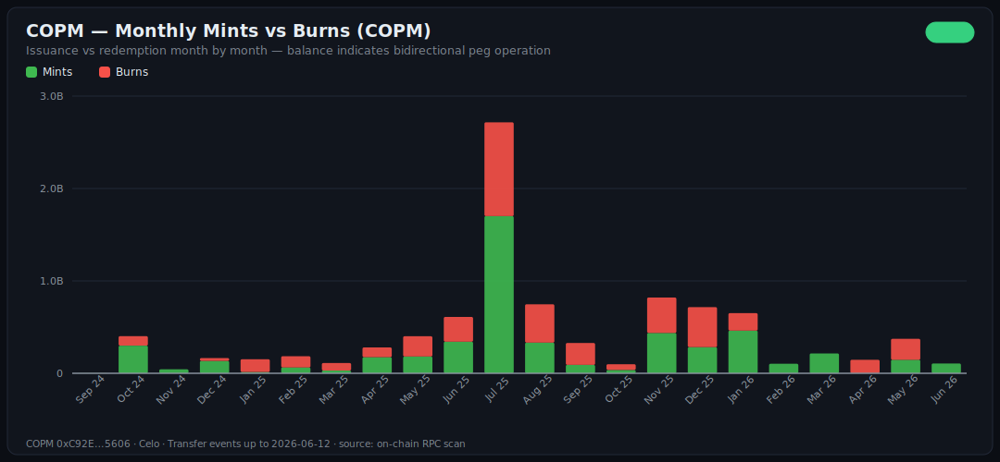
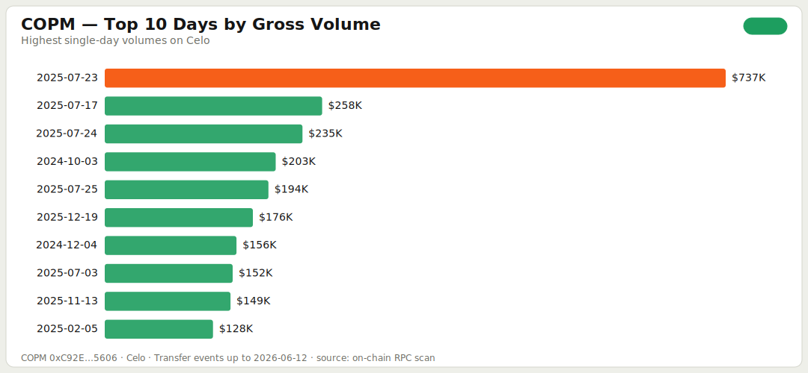

# COPM en Celo — Auditoría y análisis on-chain

> Primera auditoría on-chain de COPM en Celo: el contrato [`0xC92E8Fc2947E32F2B574CCA9F2F12097A71d5606`](https://celoscan.io/token/0xC92E8Fc2947E32F2B574CCA9F2F12097A71d5606) en Celo mainnet, cada evento `Transfer` desde el deploy hasta el bloque más reciente, validado contra la chain en vivo.
>
> 🇬🇧 [English version](./celo.md) · 📖 [Glosario](../GLOSSARY.es.md) · 🔗 [Auditoría unificada Polygon + Celo](../AUDIT.es.md)

Si la historia de COPM en [Polygon](./polygon.es.md) es la de un rail institucional, la de Celo es otra completamente distinta — y verlas juntas es donde está la gracia. Misma stablecoin, dos roles.

## Resumen ejecutivo

| Métrica | Valor |
| :--- | :--- |
| **Período auditado** | 2024-09-17 → 2026-06-12 (634 días, ~1.7 años) |
| **Eventos `Transfer`** | **120,900** |
| **Volumen bruto movido** | 46.7B COPM ≈ **$11.7M USD** |
| **Volumen neto** (sin mints/burns) | 37.3B COPM ≈ **$9.3M USD** |
| **Total emitido (mints)** | 5.20B COPM ≈ $1.30M USD |
| **Total redimido (burns)** | 4.17B COPM ≈ $1.04M USD |
| **Ticket promedio por transfer** | **~$96 USD** |
| **Promedio diario** | 191 transfers · $18.4K USD |
| **Pico de transacciones en un día** | **1,919** (2025-01-19) |
| **Pico de volumen en un día** | **$737K USD** (2025-07-23) |
| **Mes pico (volumen)** | Julio 2025: $2.15M USD |
| **Mes pico (transacciones)** | Enero 2025: 18,491 |
| **Supply actual** | 1.028B COPM ≈ $257K USD |

> **Tasa de cambio:** 1 USD = 4,000 COP, constante. Margen de ±5% según el día. Configurable al reproducir.

¿Algún término no te suena? Está en el [glosario](../GLOSSARY.es.md).

---

## La historia que cuenta la chain

### Mismo token, otra película: aquí el ticket promedio es de $96.

En Polygon, el transfer promedio de COPM mueve **~$10,300**. En Celo mueve **~$96**. Dos órdenes de magnitud de diferencia.

La lectura: Polygon carga el settlement institucional — montos grandes, partners B2B. Celo carga pagos pequeños y frecuentes — el perfil de remesas, micropagos y billeteras de usuario final. Que ambas convivan bajo el mismo token es justamente el diseño multi-chain funcionando: cada red atiende el caso de uso donde es más fuerte.



### En Polygon el despegue tardó 17 meses. En Celo, 6 semanas.

Deploy en Celo: 2024-09-17. Primer día con más de 100 transfers: **2024-10-30**.

La explicación es de manual: cuando COPM llegó a Celo, ya existía la operación, los partners y el caso de uso probados en Polygon. La segunda chain no arranca de cero — hereda la tracción de la primera. Y enero 2025 fue su mes más activo de la historia: **18,491 transacciones**.

### El volumen es chico; la actividad no.

$11.7M brutos en 1.7 años suena pequeño al lado de los $2B de Polygon — y lo es. Pero el dato que sorprende es otro: **el promedio diario de transacciones es casi idéntico entre las dos chains** (~191/día en Celo vs ~198/día en Polygon). Celo procesa un flujo constante de operaciones pequeñas: hubo actividad en 571 de los 634 días auditados (90%).



### Julio 2025: el pico de volumen.

**$2.15M en un mes**, con el 2025-07-23 moviendo **$737K en un solo día** — el récord histórico de la chain. A diferencia de Polygon (donde el pico de volumen y el de transacciones coinciden), en Celo los picos van por separado: el de transacciones fue en enero, el de volumen en julio. Otra señal de que los flujos aquí responden a dinámicas distintas.

### El supply cuadra exacto. Al peso.

Reproducir los 120,900 eventos da un supply derivado de **1,028,163,109.63 COPM**. El `totalSupply()` del contrato en vivo reporta **1,028,163,109.63 COPM**.

**Diferencia: cero.** Cada mint y cada burn de la historia del contrato en Celo está clasificado y cuadra contra el estado on-chain actual. Es la reconciliación perfecta que en contabilidad llamarías "libros cuadrados" — derivada exclusivamente de eventos públicos.



### Mints y burns: el peg también operó bidireccional aquí.

- Total emitido: **5.20B COPM**
- Total redimido: **4.17B COPM** (80% de lo emitido)
- Diferencia: 1.03B = exactamente el supply actual ✓



---

## Top 10 días

### Por transacciones

| Día | Transfers | Volumen bruto |
| :--- | ---: | ---: |
| **2025-01-19** | **1,919** | $20K |
| 2025-02-03 | 1,461 | $18K |
| 2025-01-20 | 1,408 | $14K |
| 2025-01-27 | 1,301 | $32K |
| 2025-02-02 | 1,249 | $12K |
| 2024-11-26 | 1,221 | $35K |
| 2025-02-04 | 1,218 | $39K |
| 2025-01-23 | 1,106 | $8K |
| 2025-01-29 | 1,065 | $56K |
| 2026-01-07 | 1,044 | $13K |

### Por volumen

| Día | Volumen bruto | Transfers |
| :--- | ---: | ---: |
| **2025-07-23** | **$737K** | 192 |
| 2025-07-17 | $258K | 20 |
| 2025-07-24 | $235K | 90 |
| 2024-10-03 | $203K | 8 |
| 2025-07-25 | $194K | 786 |
| 2025-12-19 | $176K | 174 |
| 2024-12-04 | $156K | 229 |
| 2025-07-03 | $152K | 37 |
| 2025-11-13 | $149K | 26 |
| 2025-02-05 | $128K | 279 |



---

## Validación

Los mismos 12 checks que en Polygon, todos en verde:

| # | Check | Resultado |
| :--- | :--- | :--- |
| 1 | Conteo de eventos vs progreso del scan | ✅ 120,900 = 120,900 |
| 2 | Cero duplicados (tx hash + log index) | ✅ 0 duplicados |
| 3 | Todos los eventos dentro del rango escaneado | ✅ 0 fuera de rango |
| 4 | Scan completo | ✅ |
| 5 | Cada bloque con evento tiene timestamp | ✅ 77,103 bloques, 0 faltantes |
| 6 | Timestamps dentro de la ventana deploy → latest | ✅ |
| 7 | Serie diaria del largo correcto | ✅ 634 días |
| 8 | Serie diaria continua | ✅ 0 gaps |
| 9 | Total del CSV = total del summary | ✅ |
| 10 | mints − burns = supply derivado | ✅ exacto |
| 11 | **Supply derivado vs `totalSupply()` en vivo** | ✅ **desviación 0.0% — cuadre exacto** |
| 12 | Spot check: 12 transfers re-verificados contra la chain | ✅ 12/12 (6 vía receipt, 6 vía logs frescos) |

Una nota del check 12: Celo migró de L1 a L2 en marzo de 2025, y los endpoints actuales no sirven receipts individuales de la era anterior a la migración. Para esas muestras, la re-verificación se hizo con una consulta fresca de `eth_getLogs` al bloque exacto — una segunda lectura independiente que confirma bloque, log index y monto. Resultado completo en [`data/celo/validation.json`](../data/celo/validation.json).

---

## Metodología

Idéntica a la de [Polygon](./polygon.es.md#metodología) — mismo pipeline, mismos scripts, solo cambia `CHAIN=celo`. Detalle relevante de esta chain: el scan cubrió ~41.6M de bloques (Celo produce bloques mucho más rápido que Polygon, especialmente después de su migración a L2), usando un RPC público con backoff adaptativo.

## Limitaciones

1. **Solo Celo.** Polygon se audita en [su propia auditoría](./polygon.es.md); la vista consolidada está en la [auditoría unificada](../AUDIT.es.md).
2. **Tasa fija 4,000 COP/USD.** Margen de ±5%.
3. **Direcciones internas no filtradas.** Igual que en Polygon.
4. **Receipts de la era L1.** No disponibles en el endpoint usado; la validación de esas muestras usó `eth_getLogs` fresco (ver arriba). Los eventos en sí están completos — el scan no depende de receipts.
5. **Timestamps interpolados.** Error máximo en el orden de segundos.

## Reproduce esta auditoría

```bash
cp .env.example .env   # el RPC público de Celo ya viene configurado
npm install
npm run audit:celo     # discover → scan → timestamps → aggregate → charts → validate
```

Con el RPC público: ~25 minutos (el scanner baja el ritmo solo cuando el endpoint lo pide). Con un RPC de pago: bastante menos.
