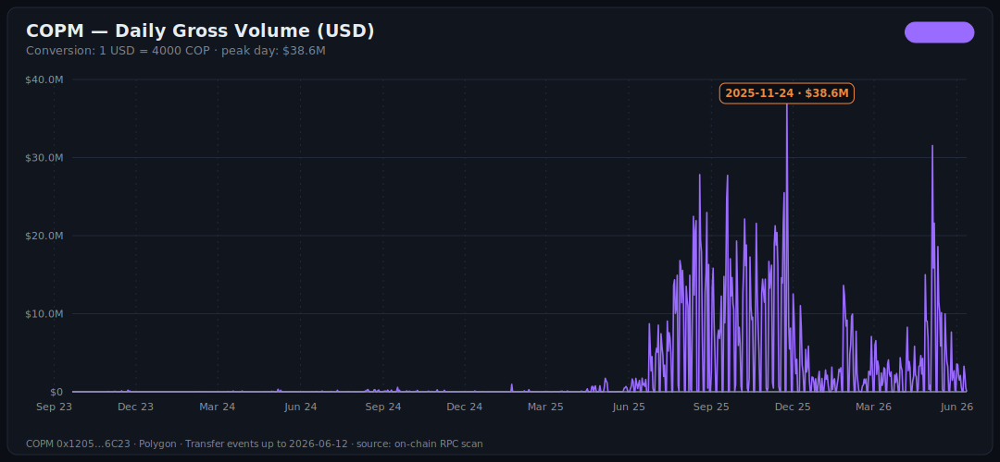
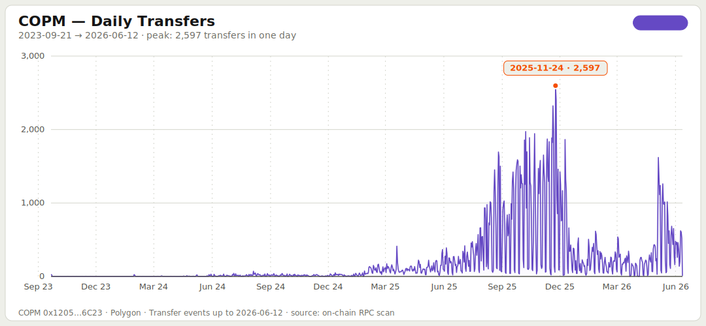
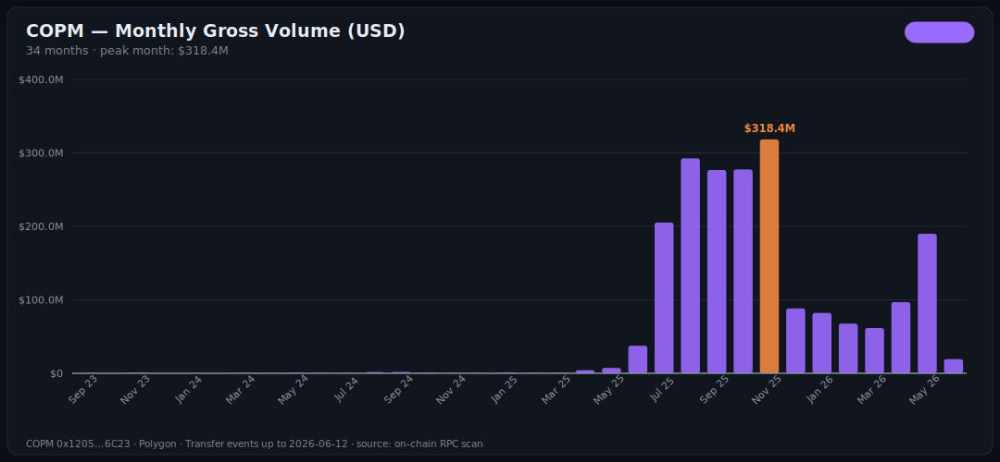
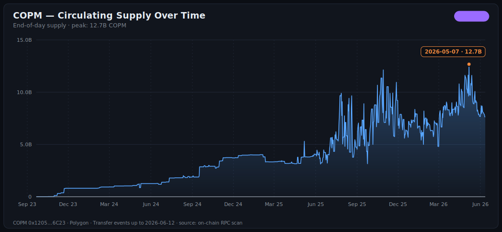
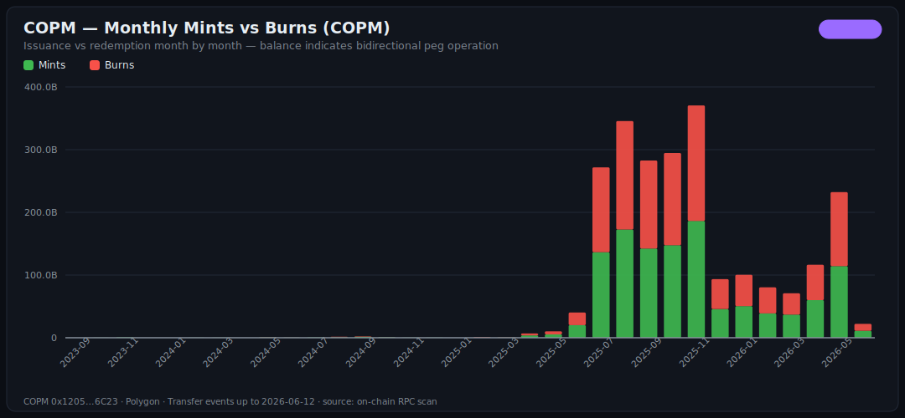
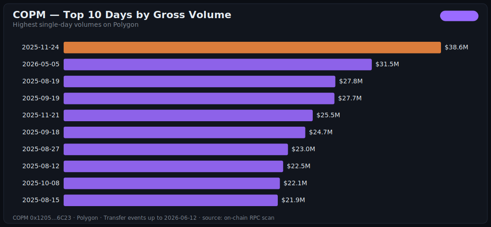

# COPM on Polygon — On-chain Audit & Analysis

> Full audit of contract [`0x12050c705152931cFEe3DD56c52Fb09Dea816C23`](https://polygonscan.com/token/0x12050c705152931cFEe3DD56c52Fb09Dea816C23) on Polygon mainnet: every `Transfer` event from the deploy block to the latest one, validated against the live chain.
>
> 🇪🇸 [Versión en español](./polygon.es.md) · 📖 [Glossary](../GLOSSARY.md) · 🔗 [Unified Polygon + Celo audit](../AUDIT.md)

The data in this document doesn't come from a dashboard or a third party. It comes from the blockchain, event by event, using the scripts in this very repository. Anyone can reproduce every number.

## Executive summary

| Metric | Value |
| :--- | :--- |
| **Audited period** | 2023-09-21 → 2026-06-12 (996 days, ~2.7 years) |
| **`Transfer` events** | **196,796** |
| **Gross volume moved** | 8.14T COPM ≈ **$2,034M USD (~$2.03B)** |
| **Net volume** (excl. mints/burns) | 5.79T COPM ≈ **$1,447M USD** |
| **Total issued (mints)** | 1.178T COPM ≈ $294M USD |
| **Total redeemed (burns)** | 1.170T COPM ≈ $293M USD |
| **Daily average** | 198 transfers · $2.04M USD |
| **Peak transactions in one day** | **2,597** (2025-11-24) |
| **Peak volume in one day** | **$38.6M USD** (2025-11-24) |
| **Peak month** | **November 2025: $318.4M USD** |
| **Supply peak** | 12.67B COPM ≈ $3.17M USD (2026-05-07) |

> **FX rate:** 1 USD = 4,000 COP, constant. The real rate fluctuated between ~3,900 and ~4,400 over the period, so USD figures carry a ±5% margin. Configurable when reproducing.

Unfamiliar with a term? It's in the [glossary](../GLOSSARY.md).

---

## The story the chain tells

### Over $2 billion moved. Not a single incident visible on-chain.

8.14 trillion (10¹²) COPM changed hands in 996 days: **~$2.03B USD** gross, **$1.45B** net between wallets. The series shows no anomalous pauses, no mass reversals, no zero days after operations ramped up.



### The token existed for 17 months before crossing 100 transactions per day.

Deploy: September 2023. First day above 100 transfers: **2025-02-03**.

That gap tells you how a B2B settlement layer scales: not through retail user acquisition, but through large integrations. Each new partner is a step, not a slope. The early months were testing; the real takeoff came when integrations hit production — and from there the curve is a different animal.



### November 2025: the month that changed everything.

**$318.4M USD in a single month. 30,983 transactions.** And within that month, an absolute record day: November 24 moved **$38.6M** across **2,597 transactions** — volume peak and activity peak on the same day.

9 of the 10 highest-transaction days in the token's entire history happened between October and November 2025. That's not noise: it's the signature of a major integration or a new use case entering production.



### After the peak, activity normalized — and re-accelerated in May 2026.

After November's high ($318M), monthly volume settled into a $60–95M range from December through April. Then **May 2026 bounced back to $189.9M**, with **2026-05-05 as the second-highest volume day ever: $31.5M**.

| Window | Gross volume |
| :--- | :--- |
| November 2025 (peak) | $318.4M |
| May 2026 (rebound) | $189.9M |
| Last 90 days | $335.2M |
| Last 30 days | $74.9M |

### Supply turns over ~35 times a month. That's a payment rail, not a vault.

- Average supply (last 30 days): ~8.5B COPM
- Gross volume (last 30 days): ~$74.9M ≈ 300B COPM
- **Implied turnover: ~35x per month, ~420x per year**

For reference: USDT and USDC turn over on the order of 10–20x **per year**. COPM rotates its supply **~25 times faster** than the major USD stablecoins. The reading is direct: nobody holds COPM — every issued peso moves dozens of times before being redeemed. That is the behavior of a *settlement rail*, not a store of value.



### Mints and burns nearly mirror each other: the peg operated in both directions.

- Total issued over 2.7 years: **1.178T COPM**
- Total redeemed: **1.170T COPM** (99.4% of issuance)

Why does this matter? Because a burn is someone converting COPM back into pesos. If burns were much smaller than mints, that would be a red flag: tokens being issued but not redeemable. The near 1:1 balance sustained over years is the on-chain evidence of a peg with fluid bidirectional operation.



---

## Top 10 days

### By transactions

| Day | Transfers | Gross volume |
| :--- | ---: | ---: |
| **2025-11-24** | **2,597** | $38.6M |
| 2025-11-25 | 2,404 | $21.8M |
| 2025-11-20 | 2,323 | $21.5M |
| 2025-10-08 | 1,972 | $22.1M |
| 2025-11-21 | 1,959 | $25.5M |
| 2025-10-22 | 1,944 | $12.8M |
| 2025-10-14 | 1,889 | $17.3M |
| 2025-11-18 | 1,885 | $14.6M |
| 2025-11-11 | 1,871 | $21.3M |
| 2025-12-09 | 1,864 | $11.0M |

### By volume

| Day | Gross volume | Transfers |
| :--- | ---: | ---: |
| **2025-11-24** | **$38.6M** | 2,597 |
| 2026-05-05 | $31.5M | 1,620 |
| 2025-08-19 | $27.8M | 1,155 |
| 2025-09-19 | $27.7M | 1,202 |
| 2025-11-21 | $25.5M | 1,959 |
| 2025-09-18 | $24.7M | 1,422 |
| 2025-08-27 | $23.0M | 1,629 |
| 2025-08-12 | $22.5M | 702 |
| 2025-10-08 | $22.1M | 1,972 |
| 2025-08-15 | $21.9M | 796 |



---

## Validation

No number in this audit is reported unverified. The validation step ([`07-validate.js`](../07-validate.js)) runs 12 checks, and all of them passed:

| # | Check | Result |
| :--- | :--- | :--- |
| 1 | Event count vs scan progress | ✅ 196,796 = 196,796 |
| 2 | Zero duplicates (tx hash + log index) | ✅ 0 duplicates |
| 3 | All events inside the scanned block range | ✅ 0 out of range |
| 4 | Scan completed (every worker reached its end) | ✅ |
| 5 | Every event block has a timestamp | ✅ 136,082 blocks, 0 missing |
| 6 | Timestamps inside the deploy → latest window | ✅ |
| 7 | Daily series has the right length | ✅ 996 days |
| 8 | Daily series is continuous (no missing days) | ✅ 0 gaps |
| 9 | CSV total equals summary total | ✅ |
| 10 | mints − burns equals derived supply | ✅ exact |
| 11 | Derived supply vs live `totalSupply()` | ✅ within bound (see caveat) |
| 12 | **Spot check: 12 transfers re-verified against live receipts** | ✅ 12/12 match |

Check 12 is the strongest one: it takes events spread across the whole dataset, re-fetches each transaction's receipt directly from the chain, and verifies that block, log index, and amount match the scanned data exactly. Full results in [`data/polygon/validation.json`](../data/polygon/validation.json).

---

## Methodology

The pipeline is 5 steps, each a Node script with no dependency beyond [viem](https://viem.sh):

1. **Discover** — finds the deploy block via binary search over `eth_getCode` and reads the token metadata (`name`, `symbol`, `decimals`, `totalSupply`).
2. **Scan** — downloads every `Transfer` event with `eth_getLogs`, in chunks of up to 10,000 blocks, parallelized across workers with adaptive backoff on rate limits.
3. **Timestamps** — resolves the timestamp of ~136K unique blocks by interpolating between hundreds of real samples (max error: seconds; irrelevant at daily granularity).
4. **Aggregate** — replays the events in order and builds the daily series: volume, mints, burns, derived supply.
5. **Charts** — renders the SVGs with no canvas and no headless browser.

**Single source: one RPC endpoint.** No indexers, no third-party APIs, no explorers. Any provider works — a paid one (faster) or a public one (free, with rate limits the scanner handles on its own).

## Limitations

1. **Polygon only.** Celo activity is audited separately in [its own audit](./celo.md), and both are consolidated in the [unified audit](../AUDIT.md).
2. **Fixed rate of 4,000 COP/USD.** ±5% margin on USD figures depending on the day.
3. **Internal addresses not filtered.** "Net" volume excludes mints and burns but doesn't distinguish movements between the issuer's corporate wallets.
4. **Derived supply vs on-chain supply.** Replaying mints − burns yields 7.63B COPM; the contract's `totalSupply()` reports 6.32B. The difference (~1.3B, stable across audits) points to proxy operations that emit events with special non-`0x0` addresses, which this analysis doesn't classify as mint/burn. It doesn't affect volumes or peaks, which are computed directly from the events.
5. **Interpolated timestamps.** By design (see methodology); max error on the order of seconds.

## Reproduce this audit

```bash
cp .env.example .env   # configure your Polygon RPC
npm install
npm run audit:polygon  # discover → scan → timestamps → aggregate → charts → validate
```

On a normal machine with a paid RPC: ~15 minutes. With a public RPC: slower, but it gets there. Every step can be re-run independently (`CHAIN=polygon npm run scan`, etc.).
